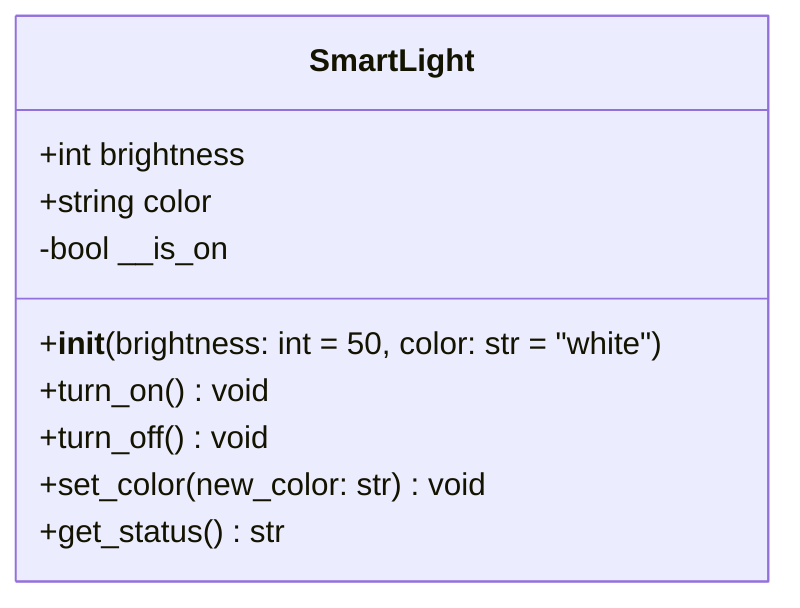
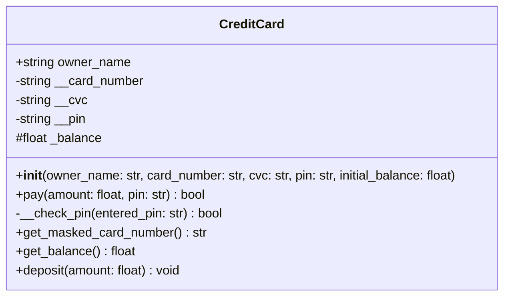
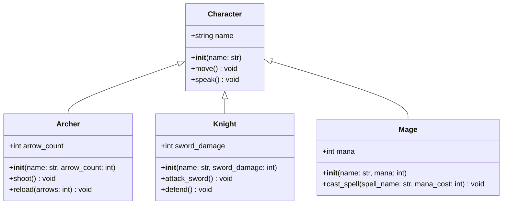
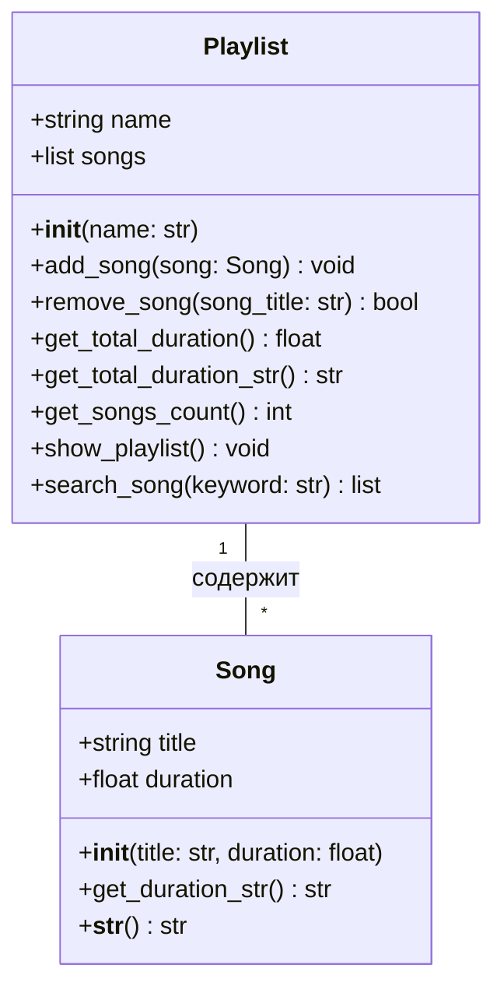
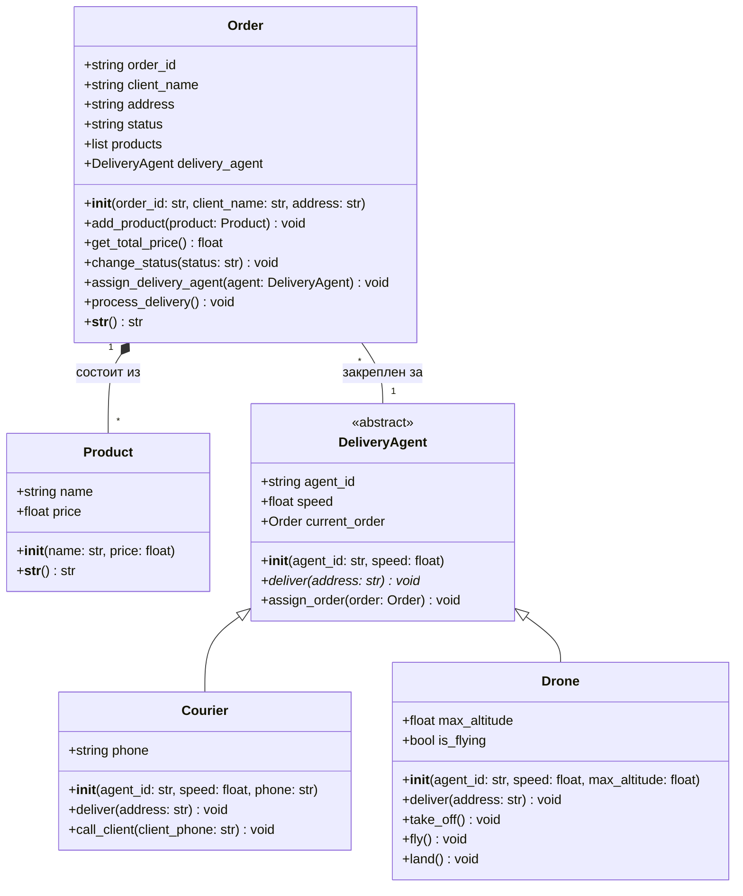
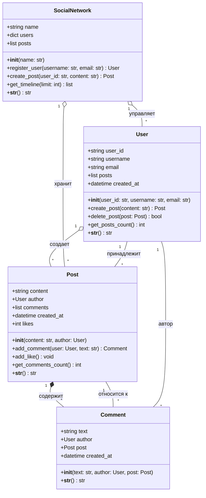

# №1

# №2

# №3

# №4

# №5

# №6

**Обоснование выбора связей:**

1. **Пользователь → Пост (`o--` - Агрегация)**:
    
    - Пользователь может создавать много постов, но пост может существовать и без пользователя (если пользователь удален, посты могут остаться в архиве).
        
    - В реальной социальной сети посты часто остаются даже после удаления аккаунта.
        
    - **Агрегация**, а не композиция, потому что пост имеет самостоятельную ценность и логику.
        
2. **Пост → Комментарий (`*--` - Композиция)**:
    
    - Комментарии не имеют смысла без поста. Если пост удаляется, все комментарии должны удаляться автоматически.
        
    - Комментарии - это часть контента поста, они тесно связаны с ним.
        
    - **Композиция**, потому что комментарии являются неотъемлемой частью поста.
        
3. **Комментарий → Пользователь (`--` - Ассоциация)**:
    
    - Комментарий ссылается на пользователя, который его оставил, но пользователь может существовать без комментариев.
        
    - Простая ассоциация, так как пользователь и комментарий относительно независимы.